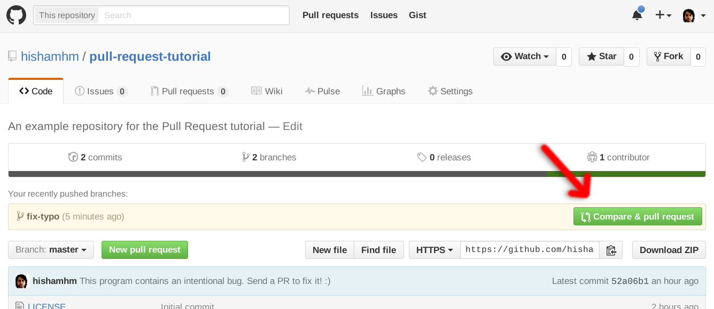

# Guía para contribuir con los repositorios de github de *Security-Environment*

¡Anímate a contribuir con entusiasmo! Asegúrate de tener una cuenta en GitHub y consulta la guía para cualquier pregunta que tengas.

## Pasos para Contribuir Exitosamente:

1. Haremos un fork de este repositorio (Hacemos click en el boton que dice fork) y clickeamos en _fork_ 

2. Clonamos este repositorio fork en nuestra cuenta local

```$ git clone git@github.com:hschmitt/devfestlima-wp-theme.git```

3. Creamos un branch donde agregaremos nuestro nuevo feature.

```$ git checkout -b feature-base-files```

4. Agregamos o editamos los archivos necesarios para nuestro cambios.

5. Seguimos nuestros cambios git add . 

6. Hacemos commit de nuestros cambios con algun mensaje descriptivo pero corto en la primera linea, desde la segunda línea en adelante podemos re-escribir el Corán si deseamos. Sumas puntos si sigues esta sintaxi 

```
feat: add new search feature
^--^  ^--------------------^
│     │
│     └--> # Descripción de los cambios
│
└──------> # Tipo del cambio
```
```
feat(backend): add filter for cars
fix(web): remove wrong color

```


```$ git commit -m 'Agregando archivos base para el tema de wordpress'```


*⚠️ Repetimos los pasos cada vez que agreguemos más cambios*

```$ git commit -m 'Agregando detalles de tema y licencia'```

```$ git commit -m 'Agregando screenshot al tema'```

7. Una vez que estemos contentos con nuestros cambios, realizamos un push al repositorio remoto.

```$ git push origin feature-base-files:feature-base-files```

Nota: 

Nuestro push esta en nuestro repositorio, se crea un nuevo branch en el repositorio remoto con nuestros cambios 

8.- Hacemos un pull request. Para esto, en la Imagen 4, en el menú superior derecho, vemos un boton que dice _Pull Request_, le hacemos clic y se nos mostrará una pantalla. En ella escribiremos qué feature(s) se agregan con nuestros cambios y por qué debería ser aceptado.



Una vez hecho el merge en el repositorio original, github te envía una notificación, y podremas ver tus cambios en el repositorio principal.